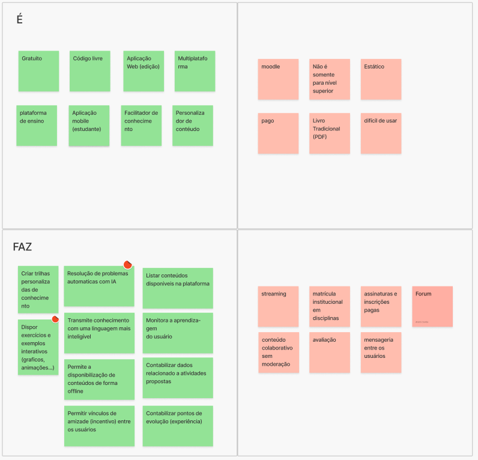

# É/não é - Faz/não faz

## 1. Introdução

Esse documento visa registrar as definições do que produto é e não é, além de o que ele deve ou não fazer. Isso foi definido pelas pessoas interessadas no projeto para o semestre 2024/2

## 2. Descrição

A fim de desenvolver a visão de produto, seguiu-se o formato proposto pelo Caroli, que busca responder as 4 perguntas a baixo:

    O que o produto é?

    O que o produto não é?

    O que o produto faz?

    O que o produto não faz?

## 3. Documento

## Referências

> Lean Inception - Como alinhar pessoas e construir o produto certo. Paulo Caroli.

## Histórico de versões

| Versão |   Data   |                Alteração                            |        Responsável              |
| :----: | :------: | :-------------------------------------:             |   :------------------------:    |
| 1.0.0  | 08/12/24 |                 Criação                             | André Corrêa e Gabriel Mariano  |
