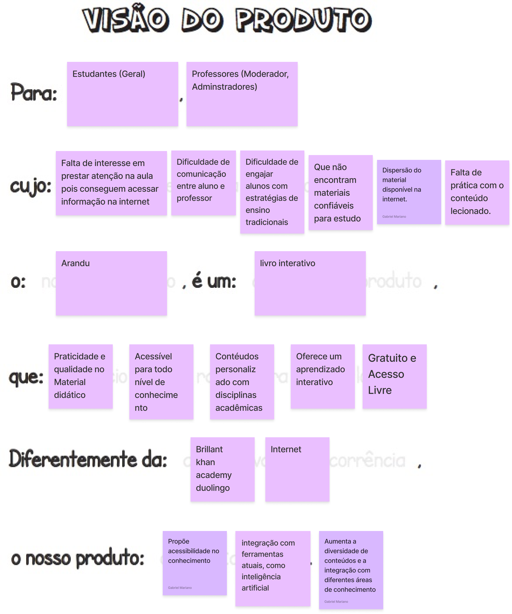

# Visão do produto

## 1. Introdução

Esse documento visa registrar a visão do produto definida pelas pessoas interessadas no projeto para o semestre 2024/2

## 2. Descrição

A fim de desenvolver a visão de produto, seguiu-se o template proposto pelo Caroli, segue principais perguntas a serem respondidas:

    Para [cliente final]

    Cujo [problema que precisa ser resolvido]

    O [nome do produto], é um [categoria do produto]

    Que [benefício chave, razão para adquiri-lo].

    Diferentemente da [alternativa da concorrência],

    O nosso produto [diferença chave].

## 3. Documento

## Referências

> Lean Inception - Como alinhar pessoas e construir o produto certo. Paulo Caroli.

## Histórico de versões

| Versão |   Data   |                Alteração                            |        Responsável              |
| :----: | :------: | :-------------------------------------:             |   :------------------------:    |
| 1.0.0  | 08/12/24 |                 Criação                             | André Corrêa e Gabriel Mariano  |
