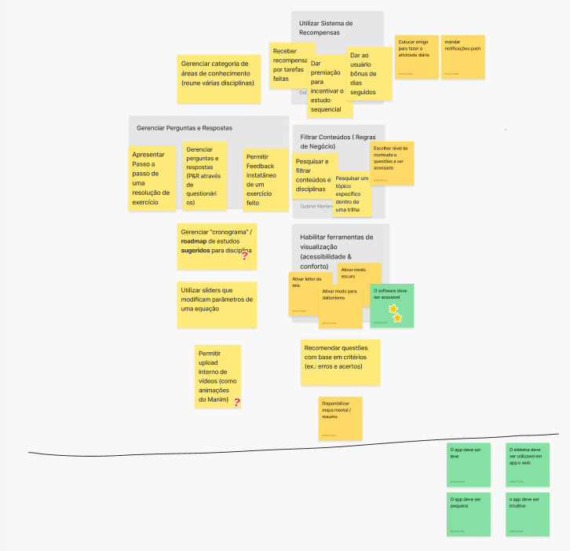

# Brainstorm de funcionalidades

## 1. Introdução

Esse documento visa registrar o brainstorm de funcionalidades para o produto. Isso foi realizado pelas pessoas interessadas no projeto para o semestre 2024/2

## 2. Descrição

A fim de realizar o brainstorm de funcionalidades, seguiu-se o formato proposto pelo Caroli, que visa elencar funcionalidades do projeto e depois agrupar essas funcionalidades em conjuntos coerentes.
## 3. Documento

## Referências

> Lean Inception - Como alinhar pessoas e construir o produto certo. Paulo Caroli.

## Histórico de versões

| Versão |   Data   |                Alteração                            |        Responsável              |
| :----: | :------: | :-------------------------------------:             |   :------------------------:    |
| 1.0.0  | 08/12/24 |                 Criação                             | André Corrêa e Gabriel Mariano  |
