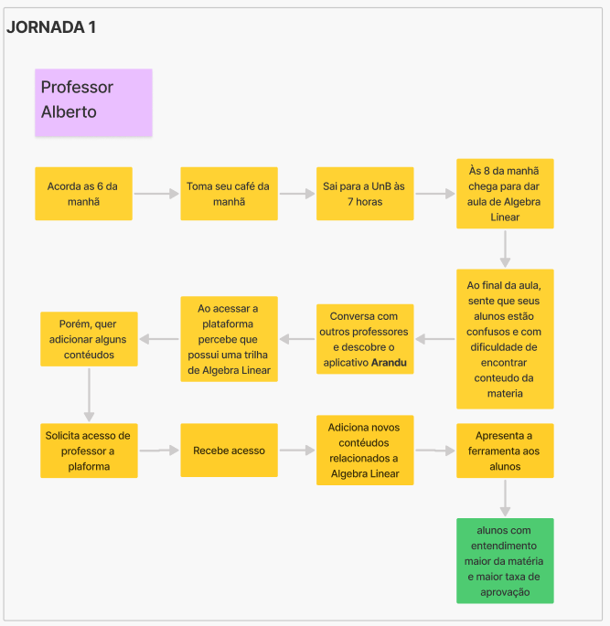
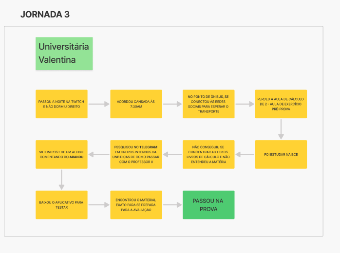
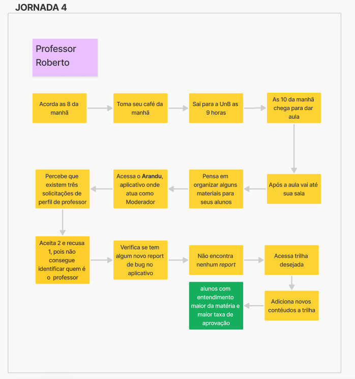

# Jornada de usuários

## 1. Introdução

Esse documento visa registrar as definições de Jornadas de usuário para as personas criadas. Isso foi definido pelas pessoas interessadas no projeto para o semestre 2024/2

## 2. Descrição

A fim de desenvolver as jornadas de usuário, seguiu-se o formato proposto pelo Caroli, que visa mostrar aonde o sistema proposto entraria no dia a dia dos usuários. Foram descritas 5 jornadas, uma para cada persona

## 3. Documento

### Jornada 1 - professor Alberto

### Jornada 2 - Pedro

### Jornada 3 - Valentina

### Jornada 4 - professor Roberto

### Jornada 5 - Fernanda

## Referências

> Lean Inception - Como alinhar pessoas e construir o produto certo. Paulo Caroli.

## Histórico de versões

| Versão |   Data   |                Alteração                            |        Responsável              |
| :----: | :------: | :-------------------------------------:             |   :------------------------:    |
| 1.0.0  | 08/12/24 |                 Criação                             | André Corrêa e Gabriel Mariano  |
