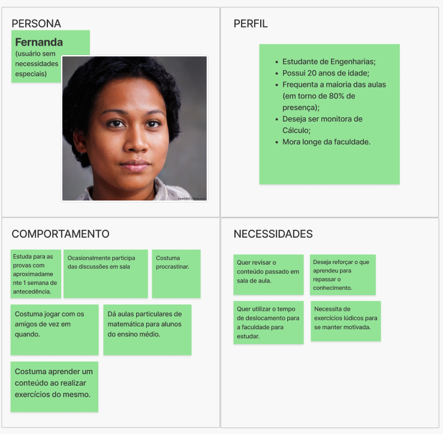

# Personas

## 1. Introdução

Esse documento visa registrar as definições de quais são as personas que representam os usuários do sistema. Isso foi definido pelas pessoas interessadas no projeto para o semestre 2024/2

## 2. Descrição

A fim de desenvolver os objetivos do produto, seguiu-se o formato proposto pelo Caroli e foram elencadas um total de 5 personas

## 3. Documento

### Persona 1 - professor Alberto

### Persona 2 - Pedro

### Persona 3 - Valentina

### Persona 4 - professor Roberto

### Persona 5 - Fernanda

## Referências

> Lean Inception - Como alinhar pessoas e construir o produto certo. Paulo Caroli.

## Histórico de versões

| Versão |   Data   |                Alteração                            |        Responsável              |
| :----: | :------: | :-------------------------------------:             |   :------------------------:    |
| 1.0.0  | 08/12/24 |                 Criação                             | André Corrêa e Gabriel Mariano  |
