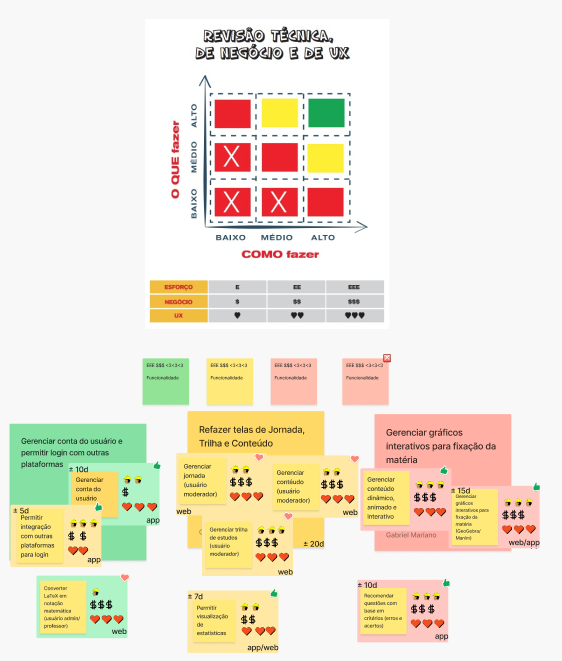

# Revisão técnica, de negócio e de UX

## 1. Introdução

Esse documento visa registrar a revisão técnica de negócio e de UX realizada. Isso foi definido pelas pessoas interessadas no projeto para o semestre 2024/2

## 2. Descrição

A fim de realizar a revisão técnica de negócio e de UX, seguiu-se o formato proposto pelo Caroli, na qual tinhamos de avaliar as funcionalidades propostas em quanto a alguns fatores, sendo eles: 

- Esforço necessário para desenvolvimento
- Valor de negócio
- Relevância para a experiência do usuário
- O quanto a equipe sabe o que deve ser feito
- O quanto a equipe sabe como deve ser feito

Além disso, foi realizada uma estimativa do tempo necessário para realizar cada tipo de atividade

## 3. Documento

## Referências

> Lean Inception - Como alinhar pessoas e construir o produto certo. Paulo Caroli.

## Histórico de versões

| Versão |   Data   |                Alteração                            |        Responsável              |
| :----: | :------: | :-------------------------------------:             |   :------------------------:    |
| 1.0.0  | 08/12/24 |                 Criação                             | André Corrêa e Gabriel Mariano  |
