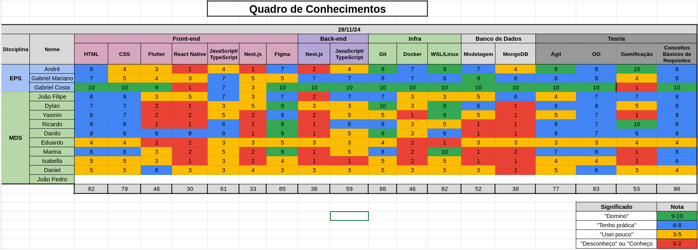

# Gestão de Conhecimentos

## Versionamento

| **Versão** | **Data** | **Modificação** | **Responsável** |
| :-: | :-: | :-: | :-: |
| 1.0 | 02/12/24 | Criação do documento | Gabriel Mariano e André Corrêa |
| 1.1 | 08/12/24 | Adição da planilha 3 | André Corrêa e Gabriel Mariano|

*Tabela 1: Versionamento*

---

## Objetivo

Dada a natureza do projeto a ser desenvolvido, faz-se de fundamental importância que os membros do mesmo desenvolvam conhecimentos técnicos alinhados ao *stack* utilizado. Deste modo, são propostos momentos de transferência de conhecimento entre os membros (**dojôs**) associados ao acompanhamento da evolução dos membros ao longo do projeto. Para tal, são preenchidas com valores variando entre **0** (indicando pouco ou nenhum conhecimento) e **10** (indicando domínio no assunto) tabelas com diversas tecnologias e habilidades dispostas.

As tabelas de conhecimento preenchidas ao longo do semestre podem ser encontradas abaixo:

### Primeira Coleta (18/10/2024)

*Figura 1: Planilha de Conhecimentos de 18/10/2024*

### Segunda Coleta (07/11/2024)

*Figura 2: Planilha de Conhecimentos de 07/11/2024*

### Terceira Coleta (28/11/2024)

*Figura 2: Planilha de Conhecimentos de 28/11/2024*

Para ver todas as planilhas pode-se acessar o seguinte [link](https://docs.google.com/spreadsheets/d/1RBjz0P8PlI9E7Ih7S0mFAS8CW2lDqglOjgUDL6Qg7gQ/edit?usp=sharing)