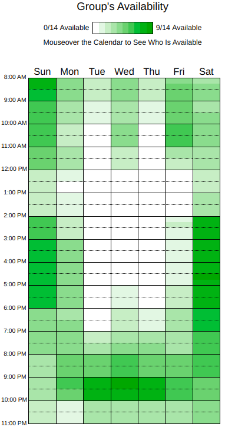

# Planejamento de Comunicação

## Versionamento

| **Versão** | **Data** | **Modificação** | **Responsável** |
| :-: | :-: | :-: | :-: |
| 1.0 | 02/12/24 | Criação do documento | Gabriel Mariano e André Corrêa |
| 1.1 | 08/12/24 | Adição do Link para o When2Meet | Gabriel Mariano e André Corrêa |

*Tabela 1: Versionamento*

---

## Objetivo

Tendo em mente a relevância da comunicação no sucesso de um projeto colaborativo, foram definidos ambientes, momentos e objetivos para a comunicação interna e externa da equipe. Deste modo, este documento almeja apresentar tais características do plano de comunicação da equipe.

## Ambientes e Objetivos

Foram definidos ambientes (virtuais e presenciais) para a comunicação da equipe, conforme pode ser visto na tabela abaixo:

| **Ferramenta** | **Ambiente** | **Escopo** | **Objetivo** |
| :-: | :-: | :-: | :-: |
|    **WhatsApp** | Virtual | Interno e Externo | Comunicação interna entre os membros da equipe de desenvolvimento [EPS + MDS] e eventual comunicação externa com o P.O. (em casos pontuais, com autorização do mesmo) |
|    **Discord** | Virtual | Interno e Externo | Comunicação interna entre os membros da equipe de desenvolvimento [EPS + MDS], o docente e comunicação externa oficial com o P.O. |
|    **Microsoft Teams** | Virtual | Interno e Externo | Comunicação interna entre os membros da equipe de desenvolvimento [EPS + MDS], o docente e comunicação externa oficial com o P.O. |
|    **ZenHub** | Virtual | Interno | Comunicação interna entre os membros da equipe de desenvolvimento [EPS + MDS]. |
|    **GitHub** | Virtual | Interno | Comunicação interna entre os membros da equipe de desenvolvimento [EPS + MDS]. |
| - | Presencial | Interno | Comunicação interna pontual entre os membros da equipe de desenvolvimento [EPS + MDS]. |

*Tabela 2: Ferramentas, Ambientes, Escopos e Objetivos de Comunicação*

## Momentos

Para além da definição de ferramentas de comunicação interna e externa da equipe, também foram definidos momentos para tais. Para isso, foi inicialmente definida uma planilha de disponibilidade para todos os membros da equipe através da ferramenta [**When2Meet**](https://www.when2meet.com/).

### Disponibilidade

A planilha abaixo pode ser encontrada com mais detalhes quanto a disposição individual dos membros da equipe na ferramenta [**When2Meet**](https://www.when2meet.com/?27101755-Ux3Wx).

*Figura 1: Planilha de Disponibilidade*

### Momentos Definidos

| **Momentos (Duração Estimada)** | **Ambiente** | **Ferramentas** | **Participantes** | **Objetivo** |
| :-: | :-: | :-: | :-: | :-: |
| Terças-feiras às 21:00 (1h) | Virtual | **Microsoft Teams** | Membros da Equipe de Desenvolvimento [EPS + MDS] | **Sprint Review**, **Sprint Retrospective** e **Sprint Planning**. |
| Terças-feiras às 15:50 (10m) | Presencial | - | Membros da Equipe de Desenvolvimento [EPS + MDS] | Alinhamento presencial (**StandUp**). |
| Quartas-feiras às 20:00 (1h) | Virtual | **Microsoft Teams** | Membros da Equipe de Desenvolvimento [EPS + MDS], P.O. e Docente | Alinhamento com o P.O.: apresentação de resultados e verificação para o desenvolvimento posterior. |
| Sábados às 15:00 (2h) | Virtual | **Microsoft Teams ou Discord** | Membros da Equipe de Desenvolvimento [EPS + MDS] | Reunião Técnica da Equipe: Dojôs, Dúvidas e Desenvolvimento. |

*Tabela 3: Momentos Definidos*

### Comunicação Instantânea

Para a comunicação instantânea entre a equipe, são usadas as ferramentas **WhatsApp** (menos formal), **ZenHub** e **GitHub** (voltadas às questões associadas ao desenvolvimento do projeto).
